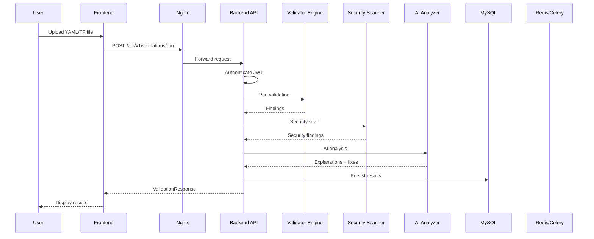

# System Design

## Design Principles

1. **Cloud-Native** — Containerized, horizontally scalable, 12-factor app
2. **Async-First** — FastAPI async endpoints, Celery for long-running tasks
3. **Security by Default** — JWT auth, RBAC, rate limiting, audit logging
4. **Graceful Degradation** — AI and CLI scanners optional with fallbacks
5. **Multi-Tenant Ready** — Teams, projects, scoped settings

## Component Interactions

## Data Flow

### Validation Pipeline

1. **Input** — Content + file path + options
2. **Type Detection** — Auto-detect YAML/Terraform from extension and content
3. **Syntax Validation** — PyYAML / HCL parser
4. **Domain Validation** — K8s, Helm, TF-specific rules
5. **Security Scan** — Multi-scanner parallel execution
6. **AI Analysis** — Line explanations and fix generation
7. **Persistence** — Store in ValidationHistory + related tables
8. **Response** — Aggregated findings with severity counts

### Authentication Flow

1. User registers → bcrypt password hash → User record
2. Login → verify password → JWT access + refresh tokens
3. MFA optional → TOTP verification on login
4. API requests → Bearer token → decode JWT → load user + roles
5. RBAC check → permission validation per endpoint

## Scalability

| Component | Scaling Strategy |
|-----------|-----------------|
| Backend API | Horizontal (multiple uvicorn workers) |
| Celery Workers | Horizontal (add worker containers) |
| MySQL | Vertical + read replicas |
| Redis | Cluster mode for high availability |
| Frontend | CDN + multiple Next.js instances |

## Database Schema Design

- **Normalized 3NF** — No redundant data
- **Cascade deletes** — ValidationHistory → Results/Scans/Explanations
- **Indexed columns** — email, username, slug, created_at
- **JSON columns** — Flexible metadata storage
- **Enum types** — SeverityLevel, ValidationStatus, UserRole

## Error Handling

- Validation errors → structured findings with line numbers
- API errors → HTTP status codes with detail messages
- Background task failures → Celery retry with exponential backoff
- Database errors → transaction rollback via session dependency

## Caching Strategy

- Redis for Celery broker and result backend
- React Query client-side cache (60s stale time)
- Settings singleton cached via lru_cache

## Backup & Recovery

- Daily automated MySQL backup via Celery Beat (2 AM UTC)
- Manual backup: `./scripts/backup.sh`
- Restore: `./scripts/restore.sh backup_file.sql`
- 90-day validation history retention (configurable)
